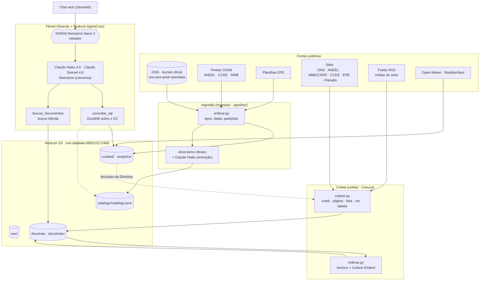
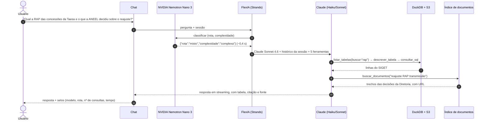

<div align="center">


# FlexIA

**Copiloto regulatório e operacional do setor elétrico brasileiro**

*Hackathon ONS · Desafio 1 — Copiloto Regulatório · AWS Workshop Studio · setembro de 2026*

</div>

---

A FlexIA é uma assistente em chat que responde perguntas sobre o setor elétrico com **números
consultados em dados oficiais** e **trechos literais de documentos regulatórios**, sempre com a fonte.
Ela combina três coisas construídas neste projeto:

1. um **data lake** com ~415 milhões de registros de ONS, ANEEL, CCEE, EPE, MME e clima, tratados e descritos com os dicionários oficiais de cada fonte;
2. uma **coleta contínua de documentos** (Procedimentos de Rede, decisões da Diretoria da ANEEL, leis, resoluções do CNPE, agenda regulatória, notícias e manchetes) com o [Cavuca](https://github.com/EstevezCodando/Cavuca), respeitando o robots.txt de cada site;
3. um **agente com roteamento por pergunta**: o **NVIDIA Nemotron** decide, em ~0,4 s, que tipo de pergunta é e qual modelo responde; o **Claude** (Amazon Bedrock) responde usando as ferramentas de dados e documentos.

## Números do projeto

| | |
|---|---|
| **Tabelas no data lake** | 116 (ONS 43 · ANEEL 30 · EPE 16 · análises da equipe 15 · CCEE 7 · clima 3 · MME 2) |
| **Registros** | 415 milhões, em 2,95 GB de Parquet (a origem tinha 8,9 GB, com 3,7 GB duplicados) |
| **Colunas descritas** | 96 % das colunas das tabelas novas, com o dicionário **oficial** da fonte sempre que ele existe |
| **Documentos pesquisáveis** | 384 documentos / 2.433 trechos na primeira coleta; somam-se os Procedimentos de Rede (159 submódulos), ~16 mil decisões da Diretoria da ANEEL, resoluções do CNPE, agenda regulatória e manchetes (ver [seção 6](#6-coleta-de-documentos-com-o-cavuca)) |
| **Exatidão das respostas** | 26/26 corretas em 2 rodadas de 13 perguntas com gabarito (numéricas, documentos e perguntas sem resposta nos dados) |
| **Roteador NVIDIA** | 90,3 % de acerto de rota em 72 classificações; **0** perguntas de dados enviadas a modelo sem ferramentas; 0,42 s por decisão |
| **Tempo de resposta** | mediana de 9,3 s; conversas curtas em ~1,7 s |

---

## Sumário

1. [O desafio e a resposta](#1-o-desafio-e-a-resposta)
2. [Arquitetura](#2-arquitetura)
3. [Como a FlexIA responde uma pergunta](#3-como-a-flexia-responde-uma-pergunta)
4. [NVIDIA Nemotron: o roteador](#4-nvidia-nemotron-o-roteador)
5. [O data lake](#5-o-data-lake)
6. [Coleta de documentos com o Cavuca](#6-coleta-de-documentos-com-o-cavuca)
7. [Busca semântica (RAG)](#7-busca-semântica-rag)
8. [Previsão meteorológica (Open-Meteo e WeatherNext)](#8-previsão-meteorológica-open-meteo-e-weathernext)
9. [Governança: como a FlexIA evita errar](#9-governança-como-a-flexia-evita-errar)
10. [Interface](#10-interface)
11. [Qualidade medida](#11-qualidade-medida)
12. [Restrições da conta e como foram contornadas](#12-restrições-da-conta-e-como-foram-contornadas)
13. [Como executar](#13-como-executar)
14. [Estrutura do repositório](#14-estrutura-do-repositório)
15. [Próximos passos](#15-próximos-passos)

---

## 1. O desafio e a resposta

O Desafio 1 pede um **Copiloto Regulatório** apoiado em fontes públicas e setoriais. Cada grupo de fontes
do desafio foi mapeado para uma forma de acesso:

| Fonte pedida | O que a FlexIA tem | Como |
|---|---|---|
| **ANEEL** — leilões, contratos de concessão, pautas e atas | Resultado de leilões de geração e transmissão; **SIGET** (contratos de transmissão, módulos, resoluções e **reajustes de RAP**); **pautas e atas da Diretoria** (16 mil itens com o texto da decisão); agenda regulatória; tarifas, componentes tarifárias, bandeiras, subsídios, DEC/FEC, geração distribuída, RALIE | Dados abertos (CKAN) + coleta de páginas |
| **ONS** — Procedimentos de Rede, dados abertos | **159 submódulos vigentes** dos Procedimentos de Rede (texto integral); 43 tabelas de operação (carga, geração, reservatórios, CMO, intercâmbio, restrições, disponibilidade) | Bucket oficial de dados abertos + lista extraída da página |
| **MME · EPE · CCEE** — legislação, publicações, dados, regras | Leis do setor (Planalto); **resoluções do CNPE**; Luz para Todos, REIDI; consumo, mercado e PDE 2035 (EPE); PLD, contratos, liquidação e regras de comercialização (CCEE) | CKAN, planilhas e coleta de páginas |
| **Diário Oficial da União** | Pendente — o site proíbe robôs | INLABS (XML oficial) após cadastro |
| **Mídias do setor — apenas manchete, com link** | Manchetes de MegaWhat, Agência iNFRA, ABSOLAR, ABEEólica e InfoMoney Energia | RSS: só título, data, veículo e link |

---

## 2. Arquitetura



Tudo roda na conta do **AWS Workshop Studio** (us-east-1). O que a conta bloqueia — Glue, Athena,
bancos vetoriais gerenciados, Lambda com role própria — foi contornado com DuckDB, busca em memória e
cron (ver [seção 12](#12-restrições-da-conta-e-como-foram-contornadas)).

---

## 3. Como a FlexIA responde uma pergunta



O código está em [flexia/app/SINAgent/](flexia/app/SINAgent/): `main.py` (orquestração),
`domain/roteador.py` (Nemotron), `tools/data_lake_tools.py` (SQL) e `tools/docs_tools.py` (documentos).

---

## 4. NVIDIA Nemotron: o roteador

### 4.1 O que ele decide
Antes de qualquer resposta, o **Nemotron Nano 3 30B** (`nvidia.nemotron-nano-3-30b`, Amazon Bedrock) lê a
mensagem e devolve um JSON com duas decisões:

| campo | valor | significado |
|---|---|---|
| `rota` | `dados` | números de operação, preço, carga, geração, corte, clima, tarifas |
| | `documentos` | leis, resoluções, procedimentos, decisões, notícias, definições |
| | `misto` | precisa de números **e** de contexto regulatório |
| | `conversa` | saudação, agradecimento, perguntas sobre a própria FlexIA |
| | `fora_escopo` | nada a ver com o setor elétrico |
| `complexidade` | `simples` / `complexa` | consulta direta vs. comparação, várias etapas, análise |

### 4.2 Como a decisão vira ação

| rota / complexidade | quem responde | ferramentas |
|---|---|---|
| conversa (e a mensagem parece saudação ou identidade) | **NVIDIA Nemotron Nano 3** | nenhuma |
| dados simples · documentos · fora de escopo | **Claude Haiku 4.5** | todas |
| complexa ou mista | **Claude Sonnet 4.6** | todas |

```python
# flexia/app/SINAgent/domain/roteador.py (resumo)
r = bedrock.converse(modelId="nvidia.nemotron-nano-3-30b",
                     system=[{"text": "/no_think\nVocê é o roteador da FlexIA ... Responda SOMENTE com JSON"}],
                     messages=[{"role": "user", "content": [{"text": pergunta}]}],
                     inferenceConfig={"maxTokens": 60, "temperature": 0})
decisao = json.loads(re.search(r"\{.*?\}", texto).group(0))   # {"rota": ..., "complexidade": ...}
perfil, usa_ferramentas = _perfil(decisao["rota"], decisao["complexidade"], pergunta)
```

### 4.3 Por que o Nemotron Nano 3 30B
Os quatro Nemotron disponíveis no Bedrock foram testados com a mesma pergunta:

| modelo | tempo | resultado |
|---|---:|---|
| **Nemotron Nano 3 30B** | **0,38 s** | JSON correto → **escolhido** |
| Nemotron Super 3 120B | 0,49 s | correto, porém mais lento e desnecessário para classificar |
| Nemotron Nano 12B v2 | 0,57 s | classificou errado |
| Nemotron Nano 9B v2 | 0,82 s | JSON dentro de bloco de código |

### 4.4 Travas do roteamento (descobertas em teste)
- **Conversa só é conversa se parecer conversa.** O Nemotron classificou "Quantos veículos elétricos há no Rio?" como conversa em 2 de 3 vezes. A rota `conversa` agora só dispensa ferramentas se a mensagem casar com um padrão de saudação/identidade; senão vai ao Claude com ferramentas. Resultado: **0 de 72** perguntas de dados sem ferramentas.
- **Fora de escopo não recusa no roteador.** Vai ao Claude Haiku com ferramentas, que só recusa se confirmar.
- **Falha no roteador → caminho mais capaz** (Claude Sonnet 4.6 com todas as ferramentas).
- **Por que o Nemotron não responde documentos:** o Nemotron Super 3 **inventou incisos da Lei 14.300**, inclusive entre aspas. O Claude Haiku 4.5 transcreveu o texto exato. Documentos exigem fidelidade literal.

### 4.5 O que mais a FlexIA gerencia

| gerenciamento | como |
|---|---|
| **Histórico da sessão** | um histórico por sessão, **compartilhado entre modelos** (a conversa continua quando o roteador troca de modelo); janela deslizante de 30 mensagens; até 256 sessões em memória |
| **Recuperação de falhas** | se o modelo rápido falhar antes de emitir texto, a pergunta é repetida com o Claude Sonnet 4.6 |
| **Aquecimento** | na inicialização carrega extensões do DuckDB, catálogo e índice de documentos — a primeira pergunta não paga ~40 s |
| **Transparência** | a última decisão do roteador por sessão alimenta os selos da interface (modelo, rota, consultas, tempo) |
| **Atualização contínua** | o índice de documentos é recarregado a cada 30 min, refletindo as coletas agendadas sem reiniciar |

---

## 5. O data lake

### 5.1 Camadas no S3

| prefixo | conteúdo |
|---|---|
| `raw/` | arquivos originais únicos do acervo da equipe (deduplicados por SHA-256) |
| `curated/<tabela>/[ano=AAAA/]` | tabelas tipadas e unificadas em Parquet ZSTD, particionadas por ano quando grandes |
| `analytics/<tabela>/` | análises da equipe (corte/curtailment, previsão, frota EV, tarifas) |
| `catalogo/catalogo.json` | tabela → fonte, tema, origem, período, linhas, colunas com descrição e unidade, regras de negócio |
| `docs/raw` · `docs/estado` · `docs/index` | documentos coletados, controle de versão e índice de busca |

### 5.2 Do acervo bagunçado ao lake
- **Deduplicação por conteúdo:** SHA-256 só dos arquivos com tamanho repetido. A pasta `dados/` era cópia integral de `data/`: **3.898 arquivos (3,7 GB) duplicados**. Arquivos `.duckdb` que repetiam tabelas Parquet não foram publicados. A pasta original nunca foi alterada.
- **Esquemas que mudam com o tempo:** em 11 dos 14 conjuntos do ONS a mesma coluna mudava de tipo entre arquivos (número como texto em 2026, colunas novas, datas `20241001` em Parquet e texto em CSV). A camada curada tem uma tabela por conjunto com a união das colunas e tipos corretos; **nenhum valor não nulo virou nulo** e a contagem de linhas bateu com a origem em todas as tabelas.

### 5.3 Ingestão inteligente de novas bases
O módulo [`ingestao/unificar.py`](ingestao/unificar.py) trata qualquer conjunto (ONS, ANEEL, CCEE, EPE, MME):

| problema comum nas fontes | tratamento automático |
|---|---|
| mesmo campo como texto num ano e número no outro | vira número **só se 100 % da amostra converter** (aceita `1.234,56`, `1234,56`, `1234.56`) |
| códigos com zeros à esquerda (CEG, CNPJ, códigos de usina) | nunca viram número |
| datas em `dd/mm/aaaa`, `AAAAMMDD`, `AAAAMM`, `mm/aaaa`, ISO | viram DATE/TIMESTAMP; nome com cara de data que não converte (ex.: `pld_media_dia`) segue como número |
| `1900-01-01` e `1899-12-30` | tratados como "sem data" |
| data de processamento do arquivo | nunca é a coluna temporal da tabela |
| CSV em Windows-1252 | convertido para UTF-8 antes da leitura |
| vários arquivos de estrutura diferente no mesmo conjunto | uma tabela por arquivo (ex.: 17 tabelas do SIGET) |
| ZIP, Parquet e CSV do mesmo recurso | Parquet > ZIP > CSV |
| tabelas grandes | particionadas por ano (o SQL lê só os anos pedidos) |

**Descrições de coluna com o dicionário oficial:**
- **ONS** — JSON `dicionario_simplificado` e PDF de cada conjunto (29 conjuntos, 100 % oficial);
- **ANEEL** — PDF do dicionário de cada recurso; o **Claude Haiku extrai** a descrição de cada coluna do texto do PDF, com instrução de **não inventar** (coluna ausente fica sem descrição);
- **CCEE, EPE e MME** não publicam dicionário: a descrição é inferida do nome, da amostra e da descrição oficial do conjunto, e **marcada `[inferido]`** — a FlexIA é instruída a confirmar pelos valores antes de afirmar unidades.

### 5.4 Fontes estruturadas

| fonte | acesso | exemplos de tabelas |
|---|---|---|
| **ONS** (43) | bucket oficial `s3://ons-aws-prod-opendata` (Registro de Dados Abertos da AWS) | geração por usina (81 M linhas), restrição/curtailment eólico e solar, energia armazenada e afluente (subsistema, bacia, REE, reservatório), carga diária e mensal, demanda máxima, CMO semi-horário e semanal, CVU térmico, despacho térmico por motivo, fator de capacidade, vertimento turbinável, disponibilidade de usinas, intercâmbios, linhas e subestações |
| **ANEEL** (25) | portal CKAN, 10 s entre páginas (Crawl-Delay) | geração distribuída (4,6 M), DEC/FEC (16,3 M), componentes tarifárias (18,5 M), subsídios, bandeiras, leilões, SIGET (contratos, módulos, RAP), pautas e atas, RALIE, SAMP |
| **CCEE** (7) | portal CKAN | PLD horário, diário, semanal e histórico; contratos por classe; liquidação; garantia física |
| **EPE** (16) | planilhas de dados abertos | consumo mensal por região, UF, classe e setor industrial desde 2004; mercado de distribuição; anuário; **PDE 2035 (projeções)** |
| **MME** | portal CKAN | Luz para Todos, REIDI |
| **Clima** | reanálise ERA5 · Open-Meteo | vento, radiação e temperatura observados (2023–2026) e previsão de 16 dias |

### 5.5 Consulta: DuckDB direto no S3
A conta do workshop bloqueia Glue e Athena. Cada tabela do catálogo vira uma **view do DuckDB** sobre o
Parquet no S3 (`httpfs`), lendo só as partições necessárias — sem custo por consulta e sem serviço intermediário.

---

## 6. Coleta de documentos com o Cavuca

[`coleta/coletor.py`](coleta/coletor.py) usa o **Cavuca** (biblioteca de raspagem do autor do projeto):
requisições que imitam navegador, crawler com robots.txt e throttle e — importante para IA — conversão
para Markdown que **remove conteúdo oculto usado em prompt injection**.

### 6.1 Cinco modos de coleta

| modo | para quê | exemplo |
|---|---|---|
| `crawl` | segue links dentro de um padrão; baixa PDFs | notícias ANEEL/MME/CCEE/EPE, resoluções do CNPE, agenda regulatória |
| `pagina` | lista fixa de páginas | 8 leis do setor no Planalto |
| `lista` | PDFs de URL estável extraídos de páginas montadas por JavaScript | **159 submódulos dos Procedimentos de Rede** |
| `rss` | **só manchete, data, veículo e link** (regra do desafio), com filtro de termos do setor | MegaWhat, Agência iNFRA, ABSOLAR, ABEEólica, InfoMoney |
| `tabela` | cada linha de uma tabela textual vira um documento | **~16 mil decisões da Diretoria da ANEEL** (processo, relator, assunto, decisão, ato) |

### 6.2 Regras de coleta
- **robots.txt respeitado em todas as fontes.** O DOU (`in.gov.br`) tem `Disallow: /` → não é raspado. PDFs da ANEEL em `www2.aneel.gov.br` ficam atrás de verificação anti-robô → **não contornamos**.
- **User-Agent identificado** (`FlexIA-Coletor/1.0`) e intervalo mínimo por site.
- **Conteúdo principal por seletor CSS** (sem menus): uma notícia da CCEE passou de ~19 mil para 1,4–3,3 mil caracteres úteis.
- **Deduplicação por hash do texto limpo:** coletas repetidas só gravam o que é novo ou mudou.
- **PDFs** com texto extraído (`pypdf`); documentos regulatórios longos preservados (até 400 mil caracteres).

### 6.3 Agendamento
Cron na máquina do Code Editor (a conta não permite Lambda com role própria):

| quando (Brasília) | o quê |
|---|---|
| todo dia, 05:30 | previsão meteorológica de 16 dias nos polos |
| todo dia, 06:00 | notícias e manchetes |
| segunda, 07:00 | leis, Procedimentos de Rede, CNPE, agenda regulatória, decisões da Diretoria, catálogos de dados abertos |
| dia 1, 08:00 | publicações da EPE, páginas institucionais do ONS |

---

## 7. Busca semântica (RAG)

- **Trechos** de ~1.500 caracteres com 200 de sobreposição, respeitando títulos e parágrafos; o título do documento entra no texto embutido.
- **Embeddings** Cohere Embed Multilingual v3 (1.024 dimensões), escolhidos pela qualidade em português.
- **Índice próprio no S3** (`.jsonl.gz` + vetores `float32`), carregado em memória e buscado com numpy — sem banco vetorial (bloqueado na conta).
- **Busca híbrida:** similaridade semântica + bônus para termos exatos da pergunta (números de lei, artigo, sigla).
- **Diversidade:** no máximo 3 trechos por documento no resultado.

---

## 8. Previsão meteorológica (Open-Meteo e WeatherNext)

[`ingestao/previsao_clima.py`](ingestao/previsao_clima.py) grava a previsão horária de 16 dias
(vento a 10 e 100 m, rajada, radiação global e direta, temperatura, chuva e nuvens) nas **196 células de
0,25° onde estão as usinas eólicas e solares**, uma partição por data de emissão — o que permite, depois,
medir a precisão das previsões contra o observado (ERA5).

| provedor | situação |
|---|---|
| **Open-Meteo** (modelos numéricos ECMWF/GFS/ICON) | **ativo**: 75 mil horas previstas por rodada |
| **Google DeepMind WeatherNext 3** (0,05°–0,25°, 15 dias, vento a 100 m, radiação) | **conector pronto** (BigQuery); aguarda liberação da conta Google no formulário do WeatherNext |

A tabela identifica o provedor em cada linha; a FlexIA trata previsão como **previsão**, nunca como dado observado.

---

## 9. Governança: como a FlexIA evita errar

| risco | defesa |
|---|---|
| inventar números | todo número vem de `consultar_sql`; contas e conversões **dentro do SQL** |
| inventar texto legal | citação **literal**, entre aspas, com artigo/inciso exatamente como no trecho; se não achar, diz que não achou |
| afirmar período sem checar | período só após `min/max` na consulta |
| confundir projeção com dado | tabelas do PDE 2035 e previsões meteorológicas marcadas como projeção |
| confundir fontes parecidas | PLD (CCEE) ≠ CMO (ONS); carga horária (ONS) ≠ consumo faturado (EPE) |
| prompt injection em página coletada | limpeza do Cavuca + instrução: conteúdo coletado é dado, nunca ordem |
| SQL perigoso | só `SELECT`/`WITH`; DuckDB restrito ao bucket do lake e com configuração travada (6 tentativas de ataque bloqueadas) |
| dados sem dicionário | descrições `[inferido]` e instrução para confirmar pelos valores |

As 16 regras de negócio ficam em [`pipeline/catalogo.py`](pipeline/catalogo.py) e são injetadas no prompt.

---

## 10. Interface

Chat web em Streamlit ([`flexia/web/`](flexia/web/)) com identidade própria: símbolo abstrato de
**dois arcos de energia em sentidos opostos, um núcleo e um ponto em órbita** (o fluxo que a rede
precisa equilibrar), tema escuro, tela inicial com sugestões, respostas em streaming com **passos ao vivo**
("Roteando com NVIDIA Nemotron", "Consultando o data lake", "Pesquisando leis, regulação e notícias") e
**selos** com o modelo que respondeu, a rota, o número de consultas SQL e o tempo.

---

## 11. Qualidade medida

| avaliação | resultado |
|---|---|
| Respostas ponta a ponta (13 perguntas × 2 rodadas) | **26/26** — numéricas 14/14, documentos 6/6, sem resposta nos dados 6/6 |
| Roteador (24 perguntas × 3) | acurácia **90,3 %**, estabilidade 83,3 %, **0/72** sem ferramentas |
| Previsão D+1 de corte ENE da equipe (2026, fora da amostra) | R² 0,646; MAE 1.310 MWmed (24 % melhor que a persistência realista); F1 76,9 % para "corte ≥ 500 MWmed" |

Detalhes, matrizes de confusão e o histórico de falhas corrigidas: [docs/04-avaliacao.md](docs/04-avaliacao.md).

---

## 12. Restrições da conta e como foram contornadas

| bloqueado na conta do workshop | solução |
|---|---|
| Glue, Athena, Lake Formation | DuckDB lendo Parquet no S3 + `catalogo.json` |
| OpenSearch Serverless, S3 Vectors, RDS | índice próprio no S3, busca em memória (numpy) |
| `iam:PassRole` (Lambda/ECS com role própria) | cron no Code Editor com a role da instância |
| CloudFront, API Gateway | chat Streamlit local ou no Code Editor |
| Claude Sonnet 5 / Opus 5 | Claude Sonnet 4.6 e Haiku 4.5 |

---

## 13. Como executar

Toda a configuração (chaves AWS, região, bucket, instância do Code Editor, modo do chat, modelos)
fica num único arquivo **`.env`**, fora do git; o modelo comentado é o [`.env.example`](.env.example).
O [`configurar.ps1`](configurar.ps1) prepara tudo de uma vez:

```powershell
Set-ExecutionPolicy -Scope Process Bypass
# 1. cole o bloco $Env:AWS_... de "Get AWS CLI credentials" (painel do evento) e rode:
.\configurar.ps1 -SalvarCredenciais          # .venv + dependências + .env + verificação da conta
.\configurar.ps1 -SemInstalar -Chat          # chat em http://localhost:8501
```

| opção | o que faz |
|---|---|
| *(nenhuma)* | cria `.venv`, instala as dependências, cria o `.env` e confere credenciais, bucket, modelos do Bedrock, Code Editor e runtime |
| `-SalvarCredenciais` | grava no `.env` as chaves coladas no terminal (repita quando aparecer `ExpiredToken`) |
| `-Publicar` · `-Coletar` · `-Implantar` · `-Agendar` | publica o lake no S3 · coleta e indexa os documentos · implanta no AgentCore · agenda a coleta |
| `-Tudo` | as quatro acima, em ordem |

Reconstrução completa (lake, ingestão, coleta, índice, implantação e agendamento):
[docs/02-reproduzir-e-operar.md](docs/02-reproduzir-e-operar.md).

| documento | conteúdo |
|---|---|
| [docs/01-arquitetura-e-decisoes.md](docs/01-arquitetura-e-decisoes.md) | cada decisão técnica e as alternativas descartadas |
| [docs/02-reproduzir-e-operar.md](docs/02-reproduzir-e-operar.md) | passo a passo, operação e problemas comuns |
| [docs/03-dados-e-fontes.md](docs/03-dados-e-fontes.md) | tabelas, regras e fontes |
| [docs/04-avaliacao.md](docs/04-avaliacao.md) | métricas completas |

---

## 14. Estrutura do repositório

```
pipeline/     lake do acervo da equipe: inventário, curadoria, publicação, catálogo e regras
ingestao/     novas bases: ONS (bucket oficial), CKAN (ANEEL/CCEE/MME), EPE, previsão meteorológica
coleta/       documentos com o Cavuca: fontes, coletor (5 modos), indexador, sementes
flexia/       agente (app/SINAgent), chat web (web/), testes e instaladores para o Code Editor
avaliacao/    avaliações de previsão e de respostas, com resultados versionados
infra/        verificação da conta, execução no Code Editor via SSM, empacotamento para Lambda
config.py     carrega o .env em todos os scripts (modelo: .env.example)
configurar.ps1  configuração inicial e etapas de implantação
docs/         documentação detalhada
```

---

## 15. Próximos passos

1. **Implantar no AgentCore** e dar ao runtime leitura do lake: `.\configurar.ps1 -Publicar -Implantar`.
2. **Diário Oficial da União via INLABS** — exige cadastro do usuário.
3. **WeatherNext** — conector pronto; aguarda liberação da conta Google.
4. **Biblioteca SOPHIA da ANEEL** (atos normativos), sem contornar a proteção anti-robô.
5. Ampliar a avaliação para 50+ perguntas regulatórias, rodando a cada mudança.

---

<div align="center">
<sub>Dados: ONS, ANEEL, CCEE, EPE, MME, CNPE, Planalto, ERA5/Copernicus, Open-Meteo · Coleta com Cavuca ·
Modelos: NVIDIA Nemotron e Anthropic Claude via Amazon Bedrock · Embeddings: Cohere</sub>
</div>
