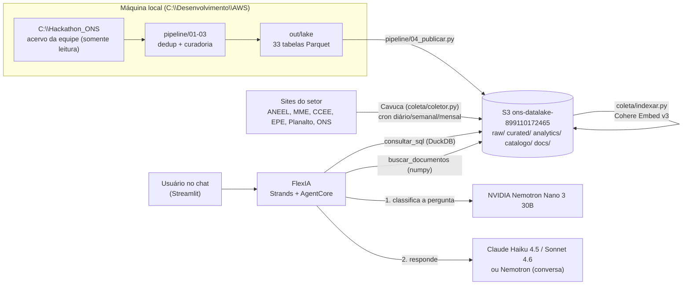

# Arquitetura e decisões

Este documento registra **o que foi construído, cada escolha e por que ela foi feita**, incluindo
o que foi tentado e descartado. Boa parte das decisões foi imposta pela conta do AWS Workshop
Studio: a role `WSParticipantRole` bloqueia vários serviços que seriam a escolha natural. Cada
restrição abaixo foi verificada por chamada real à API em 18/09/2026.

## 1. Visão geral

Três partes independentes:

1. **Data lake** — o acervo da equipe, deduplicado, com tipos corrigidos e publicado no S3.
2. **Coleta de documentos** — o Cavuca raspa fontes públicas do setor, converte para Markdown limpo
   e grava no S3; o indexador gera embeddings para busca semântica.
3. **FlexIA** — agente que decide, por pergunta, qual modelo responde e quais ferramentas usar.

## 2. Data lake

### 2.1 Deduplicação por conteúdo
- **Escolha:** SHA-256 de cada arquivo, calculado só para arquivos cujo tamanho se repete
  (`pipeline/01_inventario.py`). O caminho canônico de cada grupo segue a preferência
  `data/` > `dados/ons/` > `dados/rio_ev/` > `dados/data/`.
- **Por quê:** nomes e pastas não são confiáveis para achar duplicatas; o hash é. Calcular hash só
  de tamanhos repetidos evita ler 9 GB desnecessariamente.
- **Resultado:** `dados/` era uma cópia integral de `data/` (3.873 arquivos). Total duplicado:
  3.898 arquivos, 3,70 GB. Restaram 4.098 arquivos únicos (5,24 GB).
- Os arquivos `.duckdb` (1,4 GB) **não foram publicados**: contêm as mesmas tabelas silver/gold que
  já existem em Parquet (verificado tabela a tabela).
- A pasta de origem `C:\Hackathon_ONS` **nunca foi alterada**.

### 2.2 Camada curada com esquema unificado
- **Problema encontrado:** 11 dos 14 conjuntos do ONS mudam de esquema entre arquivos. Exemplos:
  `val_geracao` como texto em 2026 e número antes; colunas novas a partir de 2026
  (`num_minutos_*`, `nom_pontoconexao`...); `dat_programacao` como inteiro `20241001` em Parquet e
  texto em CSV; flags como `BOOLEAN` num ano e `INTEGER` no outro.
- **Escolha:** uma tabela por conjunto com a **união das colunas** e **tipo alvo por convenção de
  nome** (`val_*` → DOUBLE, `din_instante` → TIMESTAMP, `flg_*` → INTEGER, `num_minutos_*` → BIGINT).
  Implementado com DuckDB em `pipeline/03_curar.py`.
- **Por quê:** consultas e o modelo de IA erram quando a mesma coluna muda de tipo; motores de
  catálogo (Glue/Athena) falham ao inferir esquema nessas condições.
- **Garantia:** todas as conversões foram testadas contra a origem — nenhum valor não nulo virou
  nulo; contagem de linhas idêntica em todas as 33 tabelas.
- **Sobreposição de períodos:** verificada por arquivo; nenhuma encontrada (CSVs cobrem datas que
  não têm Parquet), por isso não foi necessária deduplicação de linhas.

### 2.3 Formato e particionamento
- **Escolha:** Parquet com compressão ZSTD, particionamento Hive por `ano` nas séries temporais.
- **Por quê:** Parquet é colunar (lê só as colunas usadas), ZSTD reduziu 8,9 GB para 2,1 GB, e a
  partição por ano permite ler só o período consultado (a consulta de CMO de 2025 leva ~2 s).
- **Descartado:** ordenação global por `din_instante` — estourou 16 GB de memória em 81 M linhas e
  é desnecessária, pois os arquivos de origem já são cronológicos.

### 2.4 Catálogo: JSON no S3 em vez de Glue
- **Plano original:** Glue Data Catalog + Athena, com descrições de colunas e partition projection.
- **Bloqueio:** `glue:CreateDatabase`, `glue:GetDatabases`, `athena:*`, Lake Formation e S3 Tables
  negados para a role do workshop.
- **Escolha:** `s3://…/catalogo/catalogo.json` (tabelas, caminhos, colunas, tipos, unidades,
  período, número de linhas e regras) + **DuckDB lendo o Parquet direto do S3** (`httpfs`).
- **Consequência positiva:** nenhum custo por consulta de Athena; o agente consulta o lake sem
  serviço intermediário.

### 2.5 Dicionário de dados e regras de negócio
- **Escolha:** `pipeline/catalogo.py` é a **fonte única** das descrições de tabelas/colunas e de
  13 regras de negócio. O publicador grava o `catalogo.json`; `05_gerar_flexia.py` gera o trecho do
  prompt da FlexIA a partir das mesmas regras.
- **Por quê:** o que mais afeta a exatidão do modelo é saber unidades e armadilhas dos dados.
  Regras vieram do README da equipe e de verificações feitas nos dados, por exemplo:
  - `gref` (geração de referência) supera a geração em ~49 % dos patamares sem restrição →
    volume de corte deve usar `corte_mwh`, não `gref - ger`;
  - `lim` nulo significa sem limitação; zero significa ordem de desligar;
  - o balanço de energia traz uma linha `SIN` (total) que não pode ser somada aos subsistemas
    (descoberto nesta análise);
  - `val_intercambio` = geração − carga (sinal verificado nos dados);
  - toda conta e conversão de unidade deve ser feita no SQL (regra criada após um erro de
    aritmética do modelo, ver [04-avaliacao.md](04-avaliacao.md)).

## 3. Coleta de documentos (Cavuca)

### 3.1 Por que o Cavuca
Biblioteca de raspagem do próprio autor do projeto, com requisições HTTP que imitam navegador,
crawler com respeito a robots.txt e throttle, e conversão para Markdown que **remove conteúdo
oculto usado para prompt injection** (elementos escondidos por CSS, `aria-hidden`, comentários,
caracteres de largura zero). Isso importa porque o texto coletado vai para o contexto do modelo.

### 3.2 Regras de coleta
- **robots.txt respeitado em todas as fontes** (`robots_txt_obey = True` + verificação manual):
  - `in.gov.br` (Diário Oficial) tem `Disallow: /` → **não raspamos o DOU**; o caminho oficial é o
    INLABS (XML do DOU, exige cadastro do usuário);
  - portais CKAN (ONS, ANEEL, CCEE) bloqueiam `/api/` e pedem `Crawl-Delay: 10` → coletamos as
    páginas `/dataset` com 10 s entre requisições;
  - EPE bloqueia `*.aspx` → excluído.
- **User-Agent identificado:** `Mozilla/5.0 (compatible; FlexIA-Coletor/1.0; +hackathon ONS)`.
- **Recorte do conteúdo principal por seletor CSS** por fonte (`.news-content` na CCEE,
  `.ms-rtestate-field` na EPE, `#content` no gov.br, `article.module` no CKAN). Sem isso, cada
  notícia da CCEE vinha com ~19 mil caracteres de menu; com isso, 1,4–3,3 mil de texto útil.
  - Descoberta: na CCEE o bloco da matéria fica dentro de um elemento marcado como oculto, e a
    limpeza anti-injection do Cavuca o descartava. Solução: recortar pelo seletor **antes** da
    limpeza e limpar o recorte.
- **Páginas de listagem** são percorridas para achar links, mas não viram documento.
- **Deduplicação por hash do texto limpo** (`docs/estado/<fonte>.json`): uma coleta só grava o
  que é novo ou mudou; rodar de novo não duplica nada.
- **PDFs:** extraídos com `pypdf` (até 150 páginas / 40 MB por arquivo).
- **Limites:** documento truncado em 80 mil caracteres (páginas CKAN com centenas de arquivos).
- **Limpeza:** remove botões de compartilhamento e junta linhas quebradas no meio da frase (o HTML
  do Planalto quebra frases; isso prejudicava a busca).

### 3.3 Agendamento
- **Plano original:** Lambda `flexia-coletor` disparada por regras do EventBridge (diária 06h,
  semanal segunda 07h, mensal dia 1 08h, horário de Brasília). O pacote foi construído
  (23,7 MB zip / 66,7 MB descompactado, após remover os drivers Node do Playwright/Patchright e o
  pyarrow, que sozinho ocupava 150 MB).
- **Bloqueio:** `iam:PassRole` só é permitido para a própria `WSParticipantRole`, que por sua vez só
  confia na plataforma do evento. Nenhuma role pode ser entregue à Lambda. A role criada para o
  teste foi **removida**. EventBridge Scheduler também é bloqueado.
- **Escolha final:** **cron na EC2 do Code Editor**, com a role da própria instância
  (`flexia/instalar_coletor_agendado.sh`), `flock` para impedir duas coletas simultâneas e logs por
  dia em `~/flexia-coletor/logs`. Os artefatos da Lambda (`infra/`, `coleta/lambda_handler.py`)
  continuam no repositório para uma conta que permita PassRole.

### 3.4 Índice de busca
- **Plano natural:** Bedrock Knowledge Base. **Bloqueado:** os armazenamentos vetoriais gerenciados
  disponíveis (OpenSearch Serverless, S3 Vectors) e RDS/Aurora estão negados.
- **Escolha:** índice próprio em arquivos no S3 — `docs/index/<fonte>.jsonl.gz` (texto e
  metadados) + `docs/index/<fonte>.f32` (vetores float32, 1024 dimensões). A FlexIA carrega tudo em
  memória e calcula similaridade de cosseno com numpy; recarrega a cada 30 min.
- **Por quê:** para 2.433 trechos (e dezenas de milhares no futuro) a busca exata em memória leva
  milissegundos e não exige serviço extra. O formato sem Parquet coube na Lambda (sem pyarrow).
- **Embeddings:** Cohere Embed Multilingual v3 (Bedrock), escolhido por qualidade em português.
  Trechos de ~1.500 caracteres com 200 de sobreposição, respeitando títulos e parágrafos; o título
  do documento entra no texto embutido.
- **Busca híbrida:** similaridade semântica + bônus de 0,15 × fração de termos distintivos da
  pergunta (números de lei/artigo, siglas, palavras longas) presentes no trecho.
- **Diversidade:** no máximo 3 trechos por documento no resultado. Com 2, incisos de uma lei longa
  ficavam de fora; sem limite, uma página longa ocupava todos os resultados.

## 4. FlexIA

### 4.1 Base
Projeto `SINIntelligence` do workshop (Strands Agents + Amazon Bedrock AgentCore Runtime). A v1
apenas renomeou o agente para **FlexIA** e criou a ferramenta `status_projeto`. A v2 (este
repositório, `flexia/app/SINAgent/`) substitui o `main.py` inteiro.

### 4.2 Roteamento por pergunta com NVIDIA Nemotron
- **Escolha:** o **Nemotron Nano 3 30B** classifica cada mensagem em `rota`
  (dados, documentos, misto, conversa, fora_escopo) e `complexidade` (simples, complexa); o
  roteador escolhe o modelo que responde.

| rota / complexidade | modelo que responde | ferramentas |
|---|---|---|
| conversa (só saudação/identidade; senão vai ao Haiku) | NVIDIA Nemotron Nano 3 30B | nenhuma |
| dados simples | Claude Haiku 4.5 | todas |
| documentos | Claude Haiku 4.5 | todas |
| fora_escopo | Claude Haiku 4.5 (recusa só se confirmar) | todas |
| complexa ou misto | Claude Sonnet 4.6 | todas |

- **Por que o Nano 3 30B como roteador:** dos 4 Nemotron testados com a mesma pergunta, foi o
  mais rápido (0,38 s) e depois acertou 8/8 classificações de teste. O Nano 9B v2 (0,82 s) devolveu
  o JSON dentro de bloco de código, o Nano 12B v2 (0,57 s) classificou a pergunta de teste errado e o
  Super 3 120B acertou, mas foi mais lento (0,49 s) — e é desnecessário para uma classificação.
- **Por que Claude para responder dados e documentos:** testes lado a lado (ver
  [04-avaliacao.md](04-avaliacao.md)):
  - o Nemotron Super 3 120B **inventou incisos da Lei 14.300**, inclusive entre aspas como se
    fossem citação literal, mesmo com regra explícita de transcrição; o Haiku 4.5 transcreveu o
    texto exato;
  - o Nemotron Nano chegou a recusar como "fora de escopo" uma pergunta sobre frota de veículos
    elétricos (2 de 6 classificações) — por isso "fora_escopo" não recusa mais no roteador.
- **Por que não Claude Sonnet 5 / Opus 5:** não habilitados nesta conta (AccessDenied).
- **Histórico compartilhado:** o histórico da sessão é o mesmo para todos os modelos; a conversa
  continua quando o modelo muda entre perguntas.
- **Recuperação:** se o modelo rápido falhar antes de emitir texto, a pergunta é repetida com o
  Claude Sonnet 4.6. Se o roteador falhar, a rota padrão é "misto/complexa" (o caminho mais capaz).

### 4.3 Ferramentas
| ferramenta | o que faz |
|---|---|
| `status_projeto` | lista capacidades e pendências |
| `listar_tabelas` | tabelas do lake com descrição, período e linhas (do `catalogo.json`) |
| `descrever_tabela` | colunas, tipos, unidades e significados |
| `consultar_sql` | SELECT/WITH no DuckDB sobre o S3, até 200 linhas, tempo limite de 90 s |
| `buscar_documentos` | busca híbrida nos documentos coletados, com filtros opcionais de órgão/tipo |

### 4.4 Segurança da consulta SQL
- Só `SELECT`/`WITH`, um comando por chamada; palavras de escrita/configuração bloqueadas.
- DuckDB com `allowed_directories=['s3://<bucket>/']`, `enable_external_access=false` e
  `lock_configuration=true` depois de criar as views: nenhuma consulta lê arquivo local, outro
  bucket ou muda configuração. Testado com 6 tentativas (ler `C:/Windows/win.ini`, ler outro bucket,
  `getenv`, `DROP VIEW`, dois comandos, alterar configuração) — todas bloqueadas.
- Conteúdo coletado da web é tratado como dado, nunca instrução (prompt + limpeza do Cavuca).

### 4.5 Latência
- Aquecimento na inicialização do agente (extensões DuckDB, catálogo, índice de documentos): a
  primeira consulta não paga mais ~40 s.
- Tempos medidos localmente: conversa 1,7 s; dados/documentos simples 6–15 s; mistas até ~50 s.

## 5. Chat
Streamlit (`flexia/chat_app.py`), com streaming e indicação das ferramentas usadas. Dois modos:
`local` (agente no mesmo processo; funciona hoje) e `agentcore` (chama o runtime implantado via
`invoke_agent_runtime`, depois do deploy).

## 6. O que a conta do workshop permite e bloqueia

| Permitido | Bloqueado |
|---|---|
| S3; Bedrock InvokeModel (Claude Sonnet 4.6/4.5, Haiku 4.5; Nemotron; Cohere; Titan); AgentCore (listar); EventBridge Rules; Lambda (criar); ECR; ECS; CodeBuild; Cognito; IAM CreateRole/PutRolePolicy | Glue, Athena, Lake Formation, S3 Tables, S3 Vectors, OpenSearch Serverless, RDS, Step Functions, EventBridge Scheduler, CloudFront, API Gateway, Claude Sonnet 5/Opus 5; `iam:PassRole` para qualquer role além da WSParticipantRole |

## 7. Permissões concedidas pelo sistema
- Nenhuma permissão foi concedida automaticamente. `pipeline/04_publicar.py --permitir-runtimes`
  (opcional, exige decisão explícita) anexa às roles dos runtimes AgentCore uma política
  **somente leitura** de `curated/`, `analytics/`, `catalogo/` e `docs/` do bucket.
- Credenciais: o perfil local `hackathon` foi gravado pelo próprio usuário; o código nunca grava
  ou exibe credenciais.

## 8. Acesso externo
A FlexIA não tem link público. O AgentCore exige autenticação AWS em cada chamada, e os serviços
para expor uma página (CloudFront, API Gateway, Lambda com role) estão bloqueados. Opções: mesma
rede local (`http://<ip>:8501`) ou túnel temporário com senha no chat (não implementado; expõe as
credenciais e o custo de Bedrock do usuário). O link do Code Editor **não deve ser compartilhado**:
o token dá acesso ao terminal e à conta.
